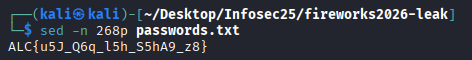
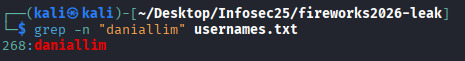

# H1 Fireworks2026 - New Year Credential Leak
Very Easy

500pts -> 356pts

18 solves

## H2 Challenge Description

During the New Year 2026 celebration, Fireworks2026 Marketplace accidentally leaked a list of usernames and encrypted passwords from one of its old test servers. Can you find the password of the user "Danial Lim", and successfully decrypt it? Download the leak here. The first user in usernames.txt corresponds to the first password in passwords.txt. The second user corresponds to the second password, and so on.

## H2 Solve

For this challenge, we are given 2 txt files, usernames and passwords. The first thing I tried to do was utilise the user "Danial Lim". 

```grep "Danial" usernames.txt```

```grep "danial" usernames.txt```



Now that I know how Danial's name is spelt, I tried to find the line it was in. 



The results would point towards line 268. Since the line corresponds between both files, it is safe to assume line 268 would contains Danial's password. Thus I ran the following command:

```sed -n 268p passwords.txt ```


With that, I have a flag looking string

```ALC{u5J_Q6q_l5h_S5hA9_z8}```

I notice the correlation of ALC and NYP and figured it was a simple Caesar Cipher. (N and P are one letter apart, similar to A and C). By shifting 13, I get:

```NYP{h5W_D6d_y5u_F5uN9_m8}```

Now this flag doesn't work, and partly because the numbers don't really fit the flag well. Thus I figured the numbers mapping

5 -> 0
6 -> 1
7 -> 2
8 -> 3
9 -> 4

This created the final flag: **NYP{h0W_D1d_y0u_F0uN4_m3}**