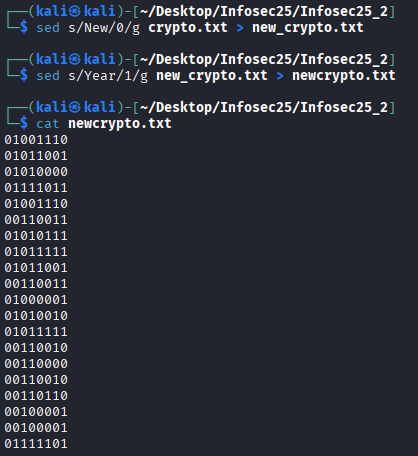

# Name
Very Easy

500pts -> 416 pts

14 solves

## Challenge Description
Happy New Year!

## Solve
Opening the file, there are 2 words, "New" and "Year" spammed all over. The first thing that comes to mind is binary as it only exists in 0s and 1s. I attempted to convert all "New" into 0s, and "Year" into 1s. 

```sed s/New/0/g crypto.txt > new_crypto.txt```

```sed s/Year/1/g new_crypto.txt > newcrypto.txt```



Decode this with any binary converter returns the flag. 

**NYP{N3W_Y3AR_2026!!}**