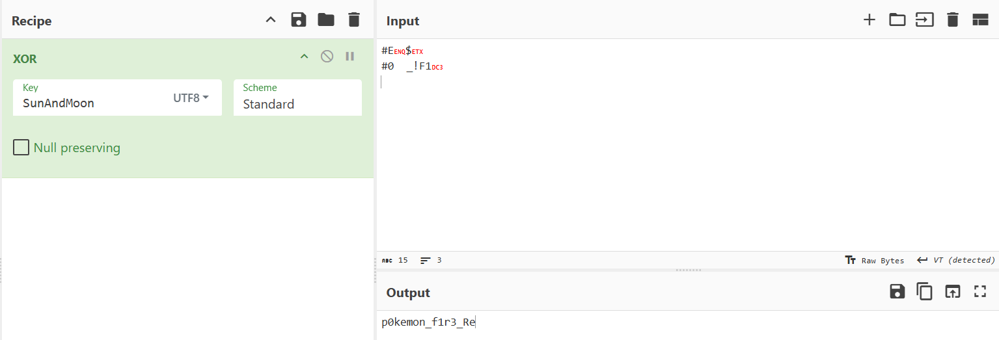

# H1 Name
Easy

500pts -> 372 pts

17 solves

## H2 Challenge Description
During the Poké Cup 2025 finals, a high-intensity battle unfolded between Ash Ketchum and Team Rocket. All battle actions, commands, and system interactions were automatically recorded by the PokéTech Battle Logging System (PBLS). However, referees detected irregular transmissions inside the logs. These logs seem to have been tampered with by Team Rocket to disrupt or manipulate the battle.

## H2 Solve
2 files were given, rules and the battle log. Firstly, I analysed the rules. 

>1. The original message is XORed with a secret key.

>2. The result of the XOR operation is then encoded using Base64.

These 2 information are key to the challenge. 

Now looking at the logs, we notice some strange messages. I pulled them all out. 

>U1RBUlRfUFJPVE9DT0w6RU5HQUdFX0JBVFRMRV9M
SU5LX09WRVJSSURFOkFSRU5BX0xPR1NfQ09OVEFJ
Tl9USEVfRkxBRzpVU0VfS0VZXydTdW5BbmRNb29u
J19UT19ERUNSWVBUOkVORF9QUk9UT0NPTA0KDQo=
I0UFJAMLIzAJXyFGMRMLAA

Now this is clearly Base64 with the presence of the "=" symbol. I decoded this from Base64 and acquired the following:


>START_PROTOCOL:ENGAGE_BATTLE_LINK_OVERRIDE:ARENA_LOGS_CONTAIN_THE_FLAG:USE_KEY_'SunAndMoon'_TO_DECRYPT:END_PROTOCOL

>#E$#0	_!F1

With this, I will XOR it with our key SunAndMoon to get a chopped up flag. I have no idea what it's like this, but having a small knowledge of Pokemon, I guess between 



```p0kemon_f1r3_Red```
```p0kemon_f1r3_ReD```
```p0kemon_f1r3_Re4```

Final Flag: **NYP{p0kemon_f1r3_Red}**