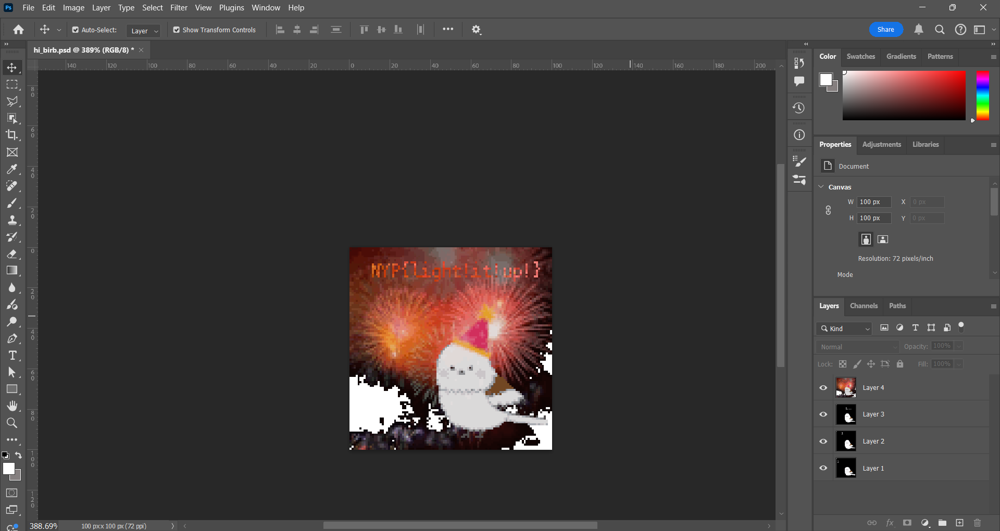

# H1 Birb Celebrates New Year
Medium

500pts -> 498pts

3 solves

Hints:
>https://www.w3.org/Graphics/GIF/spec-gif89a.txt
>https://en.wikipedia.org/wiki/GIF#Animated_GIF
>https://web.archive.org/web/20250822170534/https://www.codeproject.com/Articles/1042433/Manipulating-GIF-Color-Tables
>https://hexed.it/
>When the w3 documentation says "unsigned" what they mean is that field is 2 bytes long and can only be a positive integer.
>When the w3 documentation says "packed bit field" what they mean is even though that field is one byte, there are actually multiple fields sharing the same byte and they take up a few individual bits in there instead of being like the other fields and taking up whole bytes
>Please think about endianness when reading values. Here is a reference but there are more online: https://ntietz.com/blog/endianness/
>Paid hint: Wait why is the GCT so big when birb doesn't even have that much color?

## H2 Challenge Description
Aw man I love celebrating new years with my best buddy ol' pal my little bird friend his name is birb isn't that cute oh boy oh geez I'm so excited we're gonna do the countdown right now I can't wait oh boy oh brother you ready little guy? three...two...one.....

**NOOOOOOOOOOOOOOOOO WHAT DID THEY DO TO YOU?????**

## H2 Solve

For this challenge, we are given a gif file. 

First thing I noted was the weird last frame and the desaturated colour. My first thought was to look at it with Photoshop. 
The challenge provided many free hints about gifs and hex, I did not really understand much from them. However, when I opened the photo in Adobe Photoshop 2024, the flag showed up in the last frame. 

So not too sure what the intended solution was but there's the flag. 

**NYP{light!it!up!}**
