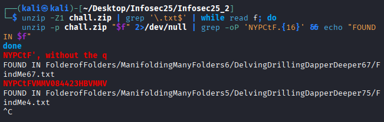
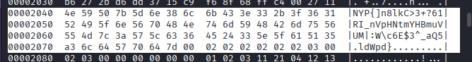

# itsfoldersallthewaydown
Easy

500pts -> 500pts

2 solves

Hints:
>The sticky note contains a path
>Paid hint: Use hexedit on the image file

## Challenge Description
You’re in charge of launching the fireworks for tonight’s New Year’s celebration, but disaster has struck. The password for the launch is buried under several hundreds of folders and .txt files. Your only clue is a sticky note that reads, “6,67,67”.Find the password!

File: https://drive.google.com/file/d/17X13_gI7PKn8wcz40Lq5u2kzl1RunjJt/view?usp=sharing

## Solve
Firstly, a sneak peak into the chall.zip shows that it's a fairly large zip bomb type of challenge. It is highly impractical to look through all the folders and txt files. The first clue was the sticky note, indicating 6, 67, 67. I used these numbers as a file path, accesing following directory:

```ManifoldingManyFolders6/DelvingDrillingDapperDeeper67/FindMe67.txt```

Inside the folder, it will contain: 
>This is the first step. Next, search for the text 'NYPCtF', without the quotation marks. The 16 proceeding characters will be the next clue. 

>Clue for the pattern: This uses Vigenère, and the key is 'python'

>The fireworks are waiting, tick tock.

Now, to search the text, this is where it got fairly computer resource consuming. 

Warning: Do not run this concurrently with other programs. Additionally, Ctrl + C the moment the second instance has been found and do not let it run in the background. (I did that and my entire computer crashed as 96% of my memory was being used)
```unzip -Z1 chall.zip | grep '\.txt$' | while read f; do unzip -p chall.zip "$f" 2>/dev/null | grep -oP 'NYPCtF.{16}' && echo "FOUND IN $f" done```

This essentially unzips to stdout and searches for the next 16 after NYPCtF. Additionally, the code will return the file path so that we can access the file later. 

The first instance would be the FindMe67.txt which provides a hint, followed by our actual file. 



Now given the file path of 5/75/4 (I'm too lazy to type the whole thing), we are given a load of random gibberish. Ctrl + F to find NYP and the next 16. 

```NYPCtFVMMV084423HBV```

Now given the previous hint, we will utilise Vigenere with the key 'python', resulting in:

```KKFC084423VOKKFC```

Now this looks useless at first, but I noted there were 6 digits:

```084423``` which could become ```08 44 23```

A potential file path has been found. Access that directory and you get:

>Congratulations.

>The password to the ZIP file located at the root is P4SSi0n&

>It will begin with Flag. 

>Hint: The file inside does not open despite being a jpeg. Perhaps it is disguised with magic? Regardless, your password will be inside the numbers that behold!

Within the chall.zip, there is a whatdis.rar, with a whatdis.jpg inside. Open it with the password provided and you'll extract it. Given the hint, opening it returns nothing, and a simple exiftool returns that it's a gif file, but just like the hint mentioned, the file type does not matter. 

Instead, the first thing I did was to perform the following strings command to attempt checking if the flag was inside at all. 

```strings whatdis.jpg | grep "NYP"```


The flag does indeed exist, so I performed a hexdump. 

```hexdump -C whatdis.jpg```

Now this hexdump is fairly long, and I'm sure there's probably a more efficient way of doing this, but I just scrolled through the whole thing hunting for my flag which I eventually find. 



Now, here's where things get strange. Neither of the following flag attempts worked. 

>NYP{]n8lkC>3+?61RI_nVpHNtmYHBmuVUM|:W\c6E$3^_aQ5ldWpd}

>NYP{]n8lkC>3+?61RI_nVpHNtmYHBmuVUM|:W\c6E$3^_aQ5 ldWpd}

>NYP{]n8lkC>3+?61RI_nVpHNtmYHBmuVUM|:W\c6E$3^_aQ5.ldWpd}

After more than 8 hours of pondering, I finally saw it. 

```00002070: a36c 6457 7064 7d00 0202 0202 0202 0300  .ldWpd}.........```

Looking towards the last line, I noticed the empty space tend to be either 0202 or 0300. However, the first "." happens to be a36c. A simple hex conversion returned the "£" symbol, completing my flag at last. 

**NYP{]n8lkC>3+?61RI_nVpHNtmYHBmuVUM|:W\c6E$3^_aQ5£ldWpd}**