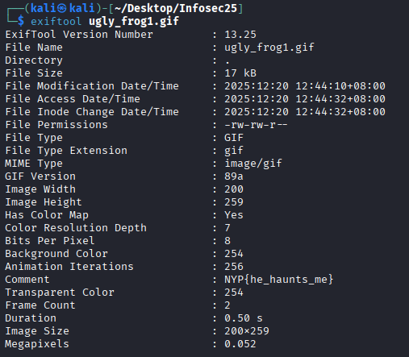

# Ugly Frog
Easy

500pts -> 356pts

18 solves

Hints:
>https://infosecwriteups.com/beginners-ctf-guide-finding-hidden-data-in-images-e3be9e34ae0d

## Challenge Description
Please get me away from it.

## Solve
File provided was a gif. 

The first thing I usually do with any media is to perform a exiftool command. 

Just like that, the flag is revealed.

**NYP{he_haunts_me}**