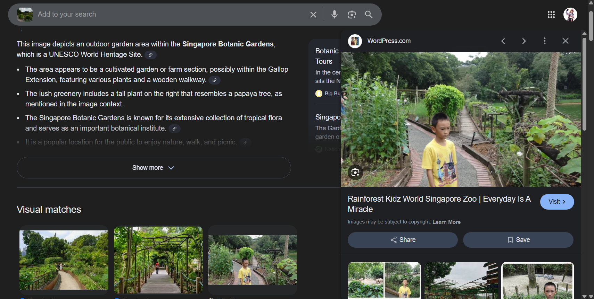
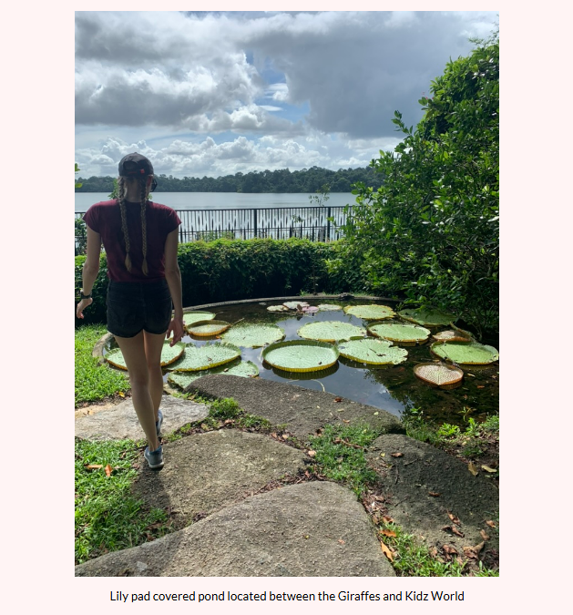
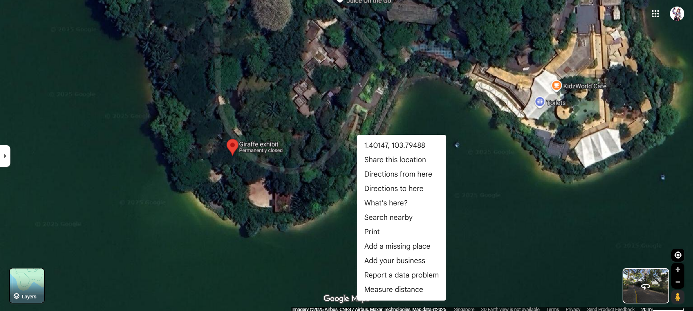

# H1 Coordinates not found (Easy, 500p -> xxxp)
---
## H2 Challenge Description
Lorem Ipsum

## H2 Solve
The photo provided is as shown below. 

Given that this is a OSINT challenge and not a forensics challenge, I did not begin with exiftools. Instead, I opted for a traditional reverse image search. 
This yieled positive results as I found a Wordpress site which happened to contain a family's trip in the exact area. 
https://cruiseoflife.wordpress.com/tag/rainforest-kidz-world-singapore-zoo/

With this information, I started searching for where the "Garden with a View" would be. Using the previously seen "Lilies", I started to search for its location, which brought me to another blogsite which had a clue. https://strictlysingapore.com/singapore-zoo/#singaporezoo

This led me to utilise Google Map's Street View to look for the location. 

Eventually, I located the general area and right clicked to acquire the coordinates. 

Thus, I concluded the coordinates for said challenge is 1.401, 103.795. Yet the flag was incorrect...
I attempted a larger range of coordinates to cover more area:
1.400-1.402, 103.790-1.799 (Yes, all 30 combinations)
Here's the janky part after this, none of this worked.
The final solution was figured after a sanity check via ticket:
1.406, 103.795

**NYP{1.406, 103.795}**