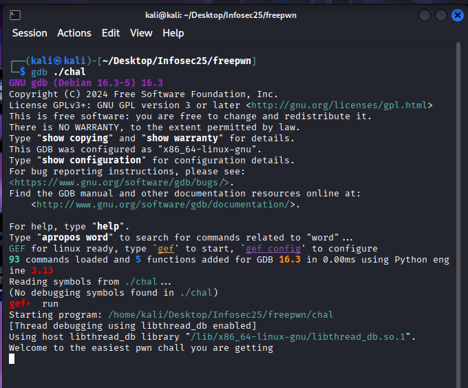
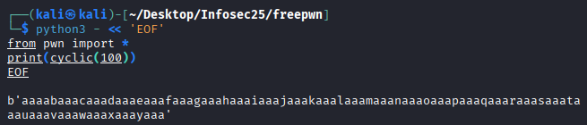
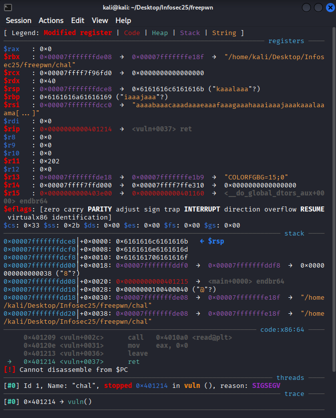
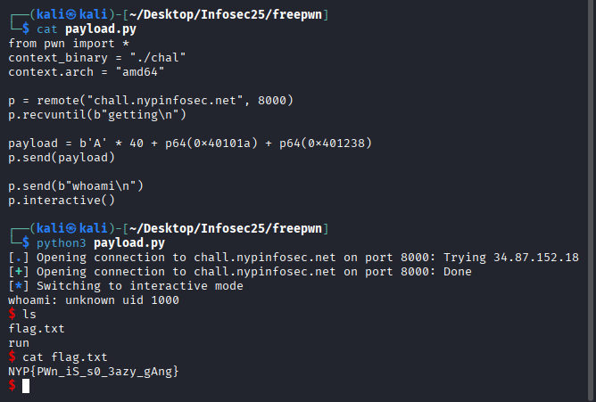

# Name
Very easy

500pts -> 476 pts

8 solves

## Challenge Description
This is going to be the easiest pwn challenge you get.

nc chall.nypinfosec.net 8000

## Solve
Ah yes, another useless description...

For this challenge, we are given dist.zip. I opened the C file to understand what the program will do when I connect via netcat. (I barely understood much...)

The first thing I noticed was the vuln() function (I think it's a function?). From my tiny understanding of C, what I could tell was that a buffer was 32 bytes large, yet the read() reads up to 64 bytes, allowing stack buffer overflow. 

I loaded the program file via gdb and ran the program. 



I created a simple Python script to get cyclic pattern (cyclic.py) and pasted this into Linux. 




One of the important things to look at was the rip value which unfortunately was not overwritten by the cyclic. 

```$rip   : 0x0000000000401214 ```

The buffer size given is 32 bytes, but in order to overwrite $rip which has ```<vuln+0037> -> ret```, I'll need to figure how long the offset is. Since 32 bytes is the buffer, I'll need to add 8 more bytes to account for the saved rbp, amounting to 40 bytes to reach the start of the saved rip. 

With this info, I created the next script to come up with the new cyclic pattern (8 bytes of As).


It still didn't get through, but this time, it was because ret did not execute. With this info, I attempt to craft the payload with the aid of pwn tools to remotely connect. Before I could fully make one, I needed the win location so I went to the directory of the chal file and performed a grep:

```nm chal | grep win ``` which returned:

```0000000000401238 T win```

Additionally I needed the ret to shift the stack and fix alignment which used another grep. 

```ROPgadget --binary chal | grep "ret$"```

It returned quite a bit of things, but the most important was ```0x000000000040101a : ret```

With this, the payload.py can be made to run. 

