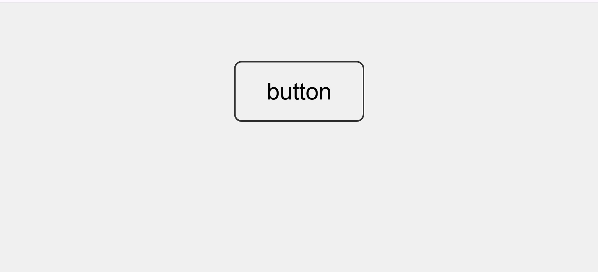

# H1 A Big Website with a Button (Easy, 500p -> xxxp)

## H2 Challenge Description
Lorem Ipsum

Note: Site may have been taken down. 

## H2 Solve
Loading the page shows a.. big white screen with a button just like the challenge name. 

Clicking on the button prompts an alert:

However, this is a false flag. 

I dug around the code and only found that it was a fairly simple site with no hidden JS of sorts. So, I attempt a curl on Linux. 

With that, the flag makes its appearance. 

**NYP{it_was_this_easy}**