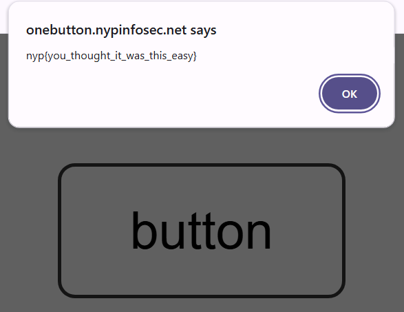
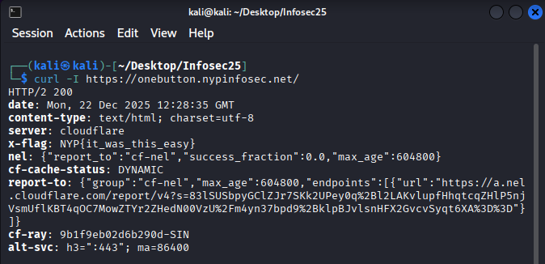

# A big website with a button In It (Easy, 500p -> xxxp)
Very easy

500pts -> 338pts

19 solves

## Challenge Description
a big website with one button in it

Note: Site may have been taken down. https://onebutton.nypinfosec.net/

## Solve
Loading the page shows a.. big white screen with a button just like the challenge name. 


Clicking on the button prompts an alert:



However, this is a false flag. 

I dug around the code and only found that it was a fairly simple site with no hidden JS of sorts. So, I attempt a curl on Linux. 

```curl -I https://onebutton.nypinfosec.net/```



With that, the flag makes its appearance. 

**NYP{it_was_this_easy}**