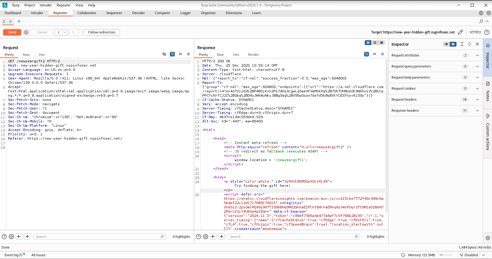
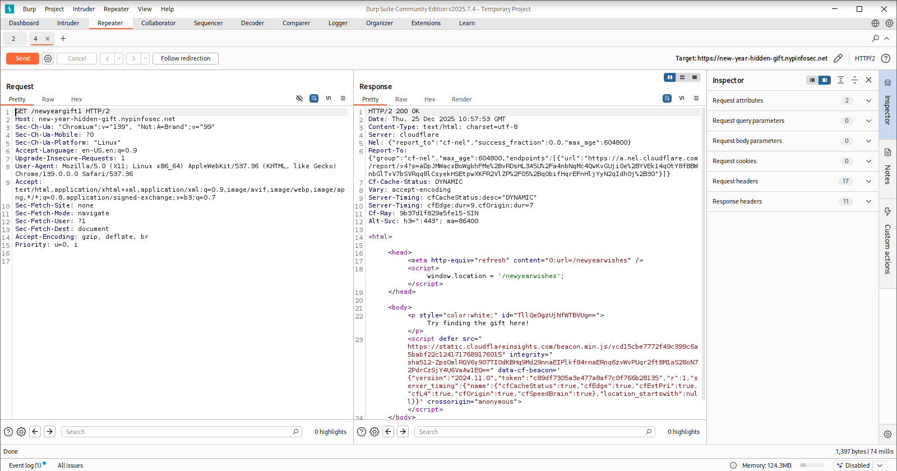

# Name
Easy

500pts -> 428 pts

13 solves

> Paid Hint: Can’t find the flag fragments in the redirect pages? Look closely — something in their content doesn’t quite belong. It may need be transformed into something readable

## Challenge Description
Happy New Year! 🎉

I’ve prepared a special New Year gift for you — the flag. But this gift has been split into two fragments and hidden somewhere along a fast sequence of redirects before reaching the final page.

Your browser moves too quickly to display what happens in between, so you may need to inspect the requests occurring during the redirect chain.

Find fragments of the gift, then combine them to reveal the complete gift.

The final page is just a celebration — the real gift is hidden in the redirects before you get there. 🎆

Good luck, and enjoy the hunt!

new-year-hidden-gift.nypinfosec.net

## Solve
Opening the site, I am faced with a huge gif plastered on the screen. No buttons, not really many signs of what I could do with the site https://new-year-hidden-gift.nypinfosec.net/newyearwishes


My first thought was to open the site with Burp Suite since I could attempt intercepting requests or catching any interesting information. 


Firstly, I loaded the original site given in the challenge and forwarded the request to the repeater and sent it from there. I noticed that it did not immediately redirect to the /newyearwishes. Instead, it would lead me elsewhere first, ./newyeargift2... Interesting. 


I decided to click "Follow Redirection" to see where it leads me and that's where I found interesting things. 



Here, notice there are mentions of a /newyeargift1. Additionally, the id of the message "Try finding the gift here" looks very suspicious. 

```XyRVUlBSMSQzX0cxRjd9```

Next, I would repeat the steps done from the start with /newyeargift1 as spamming "Follow redirection" didn't really lead me elsewhere. 


Same thing, forward to repeater and send from there. And sure enough, more sus stuff appeared again. 



A redirection to the /newyearwishes and more sus ids. 

```TllQe0gzUjNfWTBVUg==```

I noted it's likely a Base64 encoded text due to the ```==``` and tried converting both text together. 

Sure enough, the flag made its appearance: **NYP{H3R3_Y0UR_$URPR1$3_G1F7}**