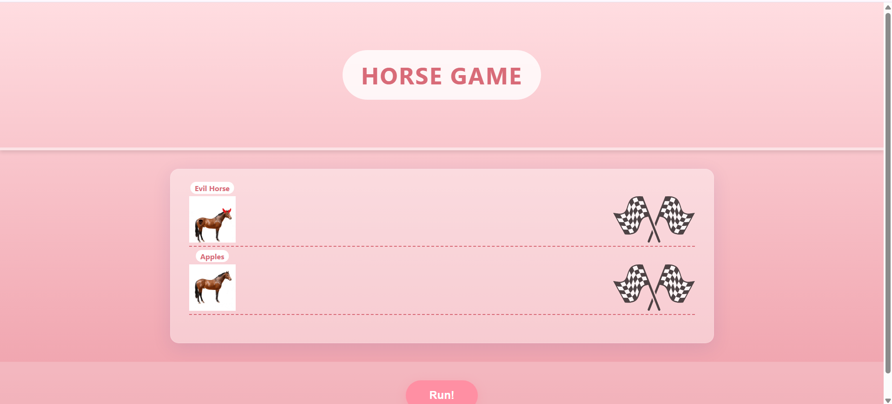
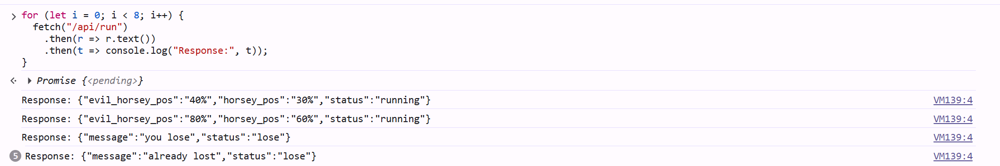
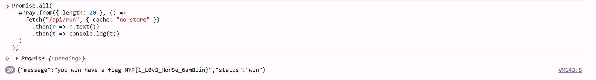

# horse games
Easy

500pts -> 450 pts

11 solves

> If only apples could run twice in one instant

## Challenge Description
To celebrate the new year we are having a horse race! I've got alot of money riding on apples please make sure he wins.

horse-games.nypinfosec.net

## Solve
The site is as seen below. v


The first thing I tried was to meddle with the site. However, this prompts an alert that fails constantly. 


So the next thing to do is to look through for this challenge was the app.py code given. I spotted a key detail in lines 33 and 34:

```     game_db[user]['horsey'] += 30```
```     game_db[user]['evil_horsey'] += 40```

This was a sign that no matter what I did with the original site, nothing was going to make me win fairly. In theory, I could attempt RCE to trigger the debug mode but since it's hosted on a server, it didn't seem viable. Additionally, deleting the cookies found within ```Inspect > Application > Cookies``` crashes the whole site. Thus, RCE was not the solution

Instead, I searched around and tried race condition. (Essentially, running concurrent requests to attempt pushing our horse to win). 

Thus I created a short code to be placed inside the console to attempt running this. 



However, I believe this didn't work since it was queueing one at a time instead of releasing everything (essentially I didn't do what I said just now). So I googled abit more to find ways to run everything concurrently, which led to the usage of ```Promise.all()```



Walah, flag: **NYP{1_L0v3_Hor5e_6am8lin}**

(I love gambling on horses, was this a Uma Musume reference?)

