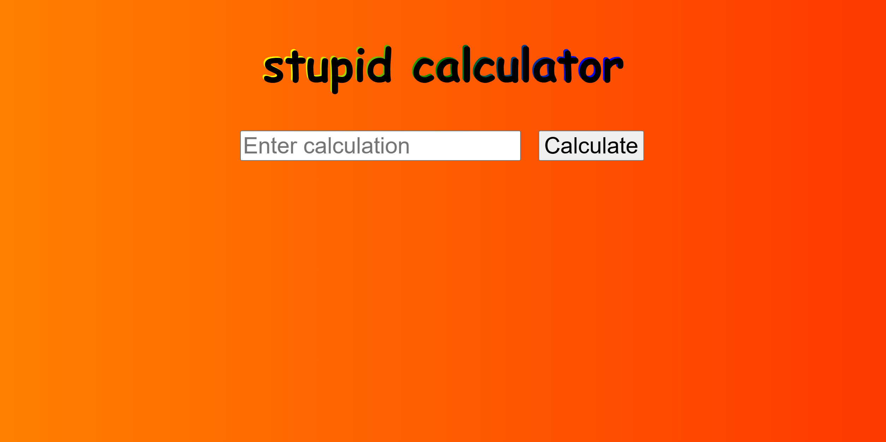
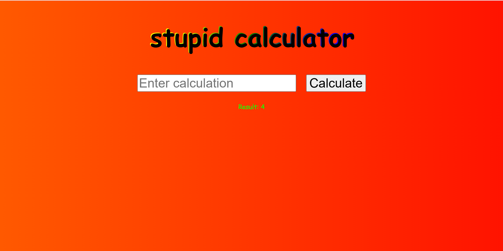
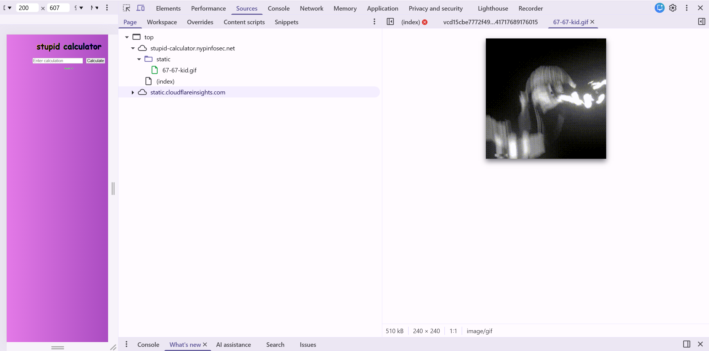
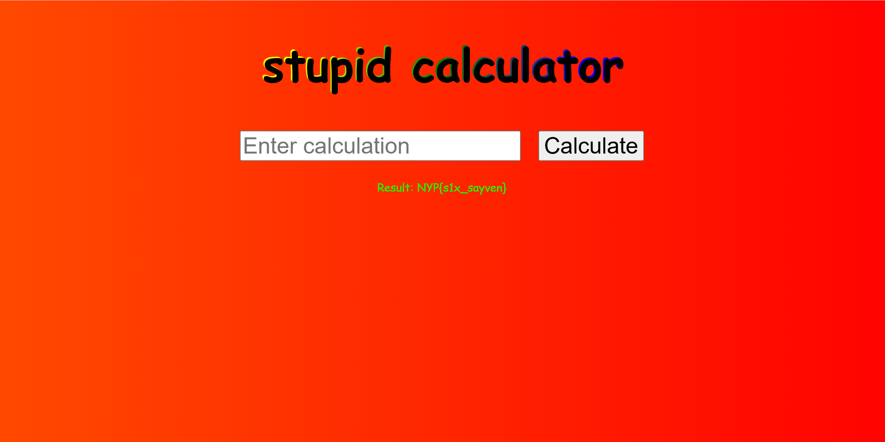

# stupid calculator
Difficulty

500pts -> 468 pts

9 solves

## Challenge Description
This is a stupid calculator

stupid-calculator.nypinfosec.net

## Solve
Right off the bat, I am faced with the most horrendous CSS possibly known to mankind when loading the site. With something as glaring as this and probably the most useless challenge description possible, I meddled with the calculator and the inspect element. (Considering the side would be taken down, it's essentially a RGB gradient flashing through in the background)



Putting in simple math like "2+2" returns correct results. Strings or words get rejected. 



Strangely, within ```Inspect > Sources```, there was a gif of sorts. 



Considering this is a web challenge, I assumed it was nonsensical to perform forensics on a gif. (It apparently shows up when you type 67 in the calculator, this generation is cooked)


The site has a form field, so my first thought would be injection of sorts. I attempted with regular text and some code chunks in general and the Python one responded interestingly. 

```print(MKEFMWKFMKWMFKW\```


This meant there was potential in Python (I guess?). So I tried a simple opening of file to attempt reading the flag straight off. 

```open("flag.txt").read()```

That worked perfectly. 



FLAG: **NYP{s1x_sayven}**

(This gen is rlly rlly cooked...)